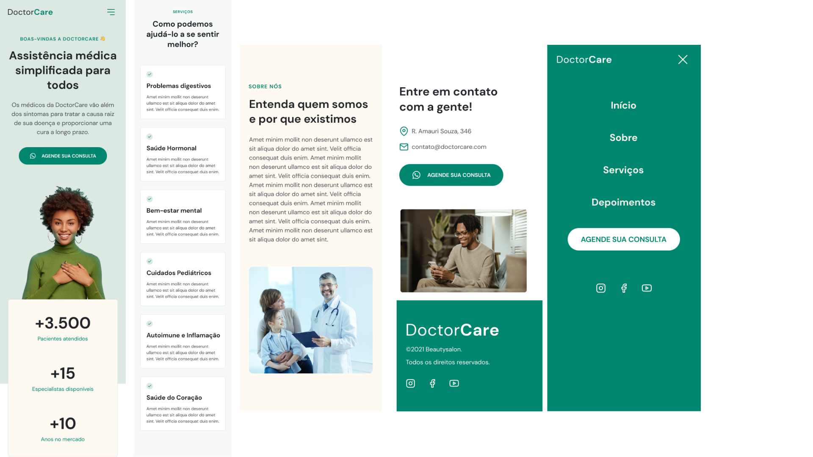

  

	
<h4 align="center"> 
	🚀 NextLevelWeek Return
</h4>

  

  
  
  
  
  <a href="https://laurirodrigues.github.io/NLW-Return-Origin/"> Visualizar Deploy </a>

<h2 align=left> 💻 Sobre o projeto </h3>

 Landing page de assistência médica feita durante o <strong>NLW Return</strong> na trilha Origin. O NLW é um evento online da <a href="https://www.rocketseat.com.br/"> <strong>Rocketseat</strong> </a> onde construímos uma aplicação do zero ao deploy em uma semana.

  
<h2 align=left> 🛠 Tecnologias utilizadas </h3>

  
  
  

<h2 align=left> 🎨 Layout </h2>
<a href="https://www.figma.com/community/file/1102912263666619803/DoctorCare"> Visualizar no Figma </a>

<h4>💻 Desktop </h4>

<h4>📱 Mobile </h4>

